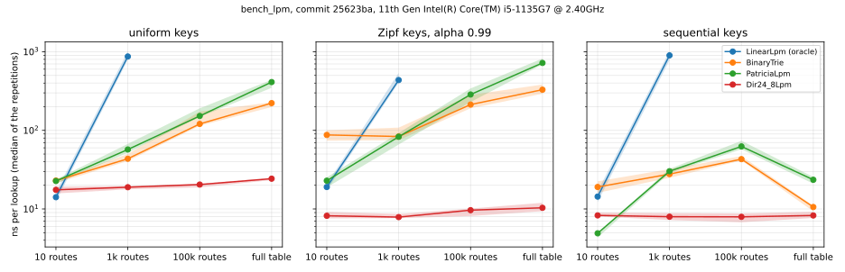

# Performance

Every number in this file is the output of a run on the machine described below; the JSON each
table came from is in `bench/results/`. Nothing here is estimated or rounded up. What a set of
numbers does *not* measure is stated next to it. The full methodology (the two tiers, the kernel
control, the repetition rules) arrives with the benchmark harness in phase 14.

## Environment

Recorded 2026-09-30.

| | |
|---|---|
| CPU | 11th Gen Intel Core i5-1135G7 @ 2.40 GHz, 4 cores / 8 threads |
| Caches (as reported by Google Benchmark) | L1d 48 KiB ×4, L1i 32 KiB ×4, L2 1280 KiB ×4, L3 8192 KiB |
| Host | Windows 11 laptop on mains power, power plan "Balanced" |
| Guest | WSL2, kernel `6.6.87.2-microsoft-standard-WSL2`, Ubuntu 24.04 |
| Compiler | GCC 13.3.0 |

### Hardware performance counters: available

`CLAUDE.md` §3 asks for this to be checked once and recorded. The `perf` tool is not installed:
Ubuntu's `linux-tools` packages are built for Ubuntu kernels, not the WSL kernel. The check used the
system call `perf` itself uses instead: `perf_event_open` with `PERF_TYPE_HARDWARE`, counting user
space only (`exclude_kernel = 1`), which `kernel.perf_event_paranoid = 2` allows without privileges.

Over a 10,000,000-iteration loop it counted **60,000,036 instructions** and 51,169,370 cycles. The
kernel also lists `branch-instructions`, `branch-misses`, `bus-cycles`, `cache-misses`,
`cache-references`, `cpu-cycles`, `instructions` and `ref-cycles` under
`/sys/bus/event_source/devices/cpu/events`. Counting kernel-mode events, and the `perf` tool itself,
were not tried.

## Phase 3: checksum microbenchmark (tier A)

**What.** `bench/micro/bench_checksum.cpp` times the three checksum paths in
`include/npf/proto/checksum.hpp`, in process, with no I/O:

- `BM_ChecksumReference/N` and `BM_OnesComplementSum/N`: the one's complement sum of N random bytes.
  20 and 60 are the smallest and largest IPv4 headers; 1500 is an MTU-sized buffer, the scale of an
  L4 checksum.
- `BM_ChecksumUpdate16`: one RFC 1624 incremental update per call, with the operands cycling
  through a 1024-entry table so that none of them is a compile-time constant.

**Code measured:** commit `906c1f3`, built from a clean tree with the `bench` preset (GCC 13.3.0,
`-O2 -g -DNDEBUG -std=c++20 -march=native`, plus the project's warning flags; the exact command is
in `build/bench/compile_commands.json`).

**How.** Pinned to one CPU. Each benchmark runs 0.5 s of warm-up, then 20 repetitions of at least
0.5 s each. Times are wall-clock per call. The matching CPU times, also in the JSON, are at most
2.9% lower in any cell of the tables below.

```bash
cmake --preset bench && cmake --build --preset bench -j
taskset -c 2 build/bench/bench/bench_checksum \
  --benchmark_repetitions=20 --benchmark_min_warmup_time=0.5 \
  --benchmark_report_aggregates_only=false --benchmark_display_aggregates_only=true \
  --benchmark_out=bench/results/<date>-<sha>-bench_checksum.json --benchmark_out_format=json \
  --benchmark_context="git_sha=<sha>,uname_r=$(uname -r),cpu_model=<model>,pmu_counters=available,cmake_preset=bench,threads=1,pinned_cpu=2"
```

### Results: run 2, started on an idle machine

`bench/results/2026-09-30-906c1f3-bench_checksum-run2.json`. Load average at the start: 0.29.

| Benchmark | Median | p95 | Min – max | CV |
|---|---:|---:|---:|---:|
| `BM_ChecksumReference/20` | 11.9 ns | 13.2 ns | 11.7 – 13.5 ns | 4.3% |
| `BM_ChecksumReference/60` | 41.3 ns | 43.3 ns | 40.5 – 45.2 ns | 2.7% |
| `BM_ChecksumReference/1500` | 917 ns | 928 ns | 901 – 931 ns | 0.9% |
| `BM_OnesComplementSum/20` | 6.16 ns | 6.78 ns | 6.01 – 6.79 ns | 4.1% |
| `BM_OnesComplementSum/60` | 19.3 ns | 20.3 ns | 19.1 – 20.6 ns | 2.2% |
| `BM_OnesComplementSum/1500` | 410 ns | 474 ns | 392 – 479 ns | 5.8% |
| `BM_ChecksumUpdate16` | 1.52 ns | 2.07 ns | 1.45 – 2.43 ns | 16.1% |

p95 is the nearest-rank 95th percentile of the 20 repetitions (the 19th fastest). CV is the standard
deviation over the mean.

### Results: run 1, started straight after a parallel build

`bench/results/2026-09-30-906c1f3-bench_checksum.json`. Same binary, same flags. Load average at
the start: 2.86. The measurement script had just rebuilt the benchmark on every core.

| Benchmark | Median | p95 | Min – max | CV |
|---|---:|---:|---:|---:|
| `BM_ChecksumReference/20` | 20.4 ns | 21.2 ns | 11.8 – 22.7 ns | 24.0% |
| `BM_ChecksumReference/60` | 52.3 ns | 55.5 ns | 40.7 – 56.2 ns | 9.3% |
| `BM_ChecksumReference/1500` | 1055 ns | 1189 ns | 987 – 1203 ns | 5.7% |
| `BM_OnesComplementSum/20` | 7.24 ns | 8.01 ns | 6.66 – 8.25 ns | 5.8% |
| `BM_OnesComplementSum/60` | 20.0 ns | 21.7 ns | 18.7 – 24.0 ns | 5.5% |
| `BM_OnesComplementSum/1500` | 423 ns | 460 ns | 396 – 473 ns | 4.6% |
| `BM_ChecksumUpdate16` | 1.47 ns | 1.52 ns | 1.45 – 1.57 ns | 1.9% |

### Why run 2 is the one quoted

In run 1 the same code ran at two distinct speeds, switching partway through a benchmark, in
either direction. In order of repetition, `BM_ChecksumReference/20` took 20.2 to 22.7 ns for its
first twelve repetitions, then 17.0 and 14.6 ns, then 11.8 ns for the last six. Straight after it,
`BM_ChecksumReference/60` went the other way: 40.7 to 41.1 ns for three repetitions, then 49.9 to
56.2 ns for the remaining seventeen. The code and its input did not change between repetitions, so
the machine did.

Taking each group's median, `BM_ChecksumReference/20`'s two levels (20.7 and 11.8 ns) are about
1.75× apart: the ratio of this CPU's base and maximum turbo clocks, 2.4 and 4.2 GHz.
`BM_ChecksumReference/60`'s (52.6 and 40.9 ns) are only about 1.3× apart. A clock changing speed,
by different amounts at different moments, would explain both, plausibly because the build that
ran just before had used up the package's power budget. That cause is a hypothesis, not something
measured from inside the VM.

Run 2 used the same binary but waited for the one-minute load average to fall below 0.3 before
starting. Its sums stayed at the fast level throughout (`BM_ChecksumReference/20`: 11.7 to
13.5 ns). It was not free of variation either: `BM_ChecksumUpdate16` had slow repetitions at the
start (1.98 ns) and at the end (2.07, 2.43, 1.91 ns), hence its 16.1% CV against run 1's 1.9%. The
two runs' medians for it still differ by only 0.06 ns.

Run 1's file is kept because it is a real run.

**Consequence for every later measurement.** Wall-clock time on this machine is only as steady as
the CPU clock, which Windows controls. So: build first, wait for the machine to go quiet, then
measure, and compare runs taken the same way.

### What these numbers do not measure

- **The forwarding path.** This is tier A in isolation. Each loop reads the same buffer, which sits
  in L1 cache the whole time, so no cache miss is ever timed. The cost of an incremental update
  inside the real pipeline is phase 15's `BM_FullDatapath`, not this.
- **A fixed clock.** WSL2 on a laptop: the CPU's frequency follows turbo and the Windows power
  plan. The JSON's `cpu_scaling_enabled: false` only means the VM has no cpufreq interface to read.
- **Generated code.** With `-march=native` the compiler is free to vectorise both sums; the
  assembly was not inspected, so nothing here says whether it did.
- **Anything but this machine and this compiler.** One CPU, GCC 13.3.0 only.

## Phase 10: longest-prefix match on a full routing table (tier A)

**What.** `bench/micro/bench_lpm.cpp` times the four longest-prefix-match tables in
`include/npf/table/`, in process, with no I/O, at four sizes of route table. For each table and
size:

- `lookup/<table>/<size>/<keys>`: one call of the table's non-virtual `lookup()` (inline, in the
  three new tables), for an address taken in turn from 2^20 (1,048,576) addresses drawn one of three
  ways:
  - `uniform`: uniformly at random from all 2^32 addresses;
  - `zipf`: a prefix of the route table, drawn by Zipf's law with α = 0.99 (the prefix of rank *r*
    has weight 1/*r*^0.99, and ranks are shuffled over the prefixes, so that a prefix's popularity
    has nothing to do with its place in the file), then an address uniformly at random inside it;
  - `sequential`: consecutive addresses, from the lowest address any prefix of the table starts at.
- `build/<table>/<size>`: constructing the table and building it from the routes with `build()`;
  `LinearLpm`, which has no `build()`, is given them one `add()` at a time. Freeing it is not timed.
- `memory/<table>/<size>`: not timed. `memory_bytes()` against how much the process's resident set
  grew while the table was built, measured once.

`LinearLpm`, the oracle, runs at 10 and 1k routes only.

**The routes.** The route-views2 collector's RIB dump of 2026-10-04 00:00 UTC,
`rib.20261004.0000.bz2` from archive.routeviews.org. `scripts/fetch_bgp_table.sh` downloads it, and
`scripts/mrt_to_prefixes.py` flattens it to a line per IPv4 unicast RIB record: a prefix, and a
number standing for its next hop, the BGP NEXT_HOP of the first route the dump lists for it. The 10,
1k and 100k tables are uniform random samples of those lines, drawn with a fixed seed.

The dump lists 11 prefixes twice, so its 1,126,578 lines hold 1,126,567 distinct prefixes. A table
keeps one route per prefix, the last one given, so the full table holds 1,126,567 routes. No sample
happens to hold a prefix twice.

| | 10 routes | 1k routes | 100k routes | full table |
|---|---:|---:|---:|---:|
| Routes | 10 | 1,000 | 100,000 | 1,126,567 |
| Distinct next hops | 8 | 18 | 20 | 21 |
| Shortest – longest prefix | /22 – /24 | /14 – /24 | /8 – /32 | /0 – /32 |
| Addresses under a prefix other than the default route | 3,584 | 2,755,584 (0.064%) | 366,361,670 (8.53%) | 3,127,860,336 (72.83%) |

In the full table, 722,405 prefixes are /24s, and 2,207 are longer than /24, in 1,573 different
/24s.

**Code measured:** commit `25623ba`, built from a clean tree with the `bench` preset: GCC 13.3.0,
`-O2 -g -DNDEBUG -march=native` as the JSON records them, with C++20 and the project's warning flags
besides. Same machine and environment as above: the JSON records the same CPU and kernel
`6.6.87.2-microsoft-standard-WSL2`.

**How.** Pinned to one CPU, and started once the one-minute load average had fallen below 0.3. It
was 0.27 when the script checked; Google Benchmark recorded 0.327 a few seconds later, with the
route tables loaded. Each timed benchmark runs 0.5 s of warm-up, then 7 repetitions of at least
0.5 s each, 7 because `docs/BUILD_PLAN.md` asks for 7. Of 7 repetitions, the nearest-rank p95 is the
slowest. Times are wall-clock; the matching CPU times, also in the JSON, are at most 3.21% lower in
any repetition. The whole run took 353.88 s.

```bash
cmake --preset bench && cmake --build --preset bench -j --target bench_lpm
taskset -c 2 build/bench/bench/bench_lpm \
  --benchmark_repetitions=7 --benchmark_min_warmup_time=0.5 \
  --benchmark_report_aggregates_only=false --benchmark_display_aggregates_only=true \
  --benchmark_out=bench/results/<date>-<sha>-bench_lpm.json --benchmark_out_format=json \
  --benchmark_context="git_sha=<sha>,uname_r=$(uname -r),cpu_model=<model>,pmu_counters=available,cmake_preset=bench,threads=1,pinned_cpu=2,bgp_dump=route-views2 rib.20261004.0000"
```

### Results: lookups

`bench/results/2026-10-04-25623ba-bench_lpm.json` (dated in UTC). The plot shows each table's
median, with the band from its fastest to its slowest repetition shaded:



ns per lookup, median / p95 of the 7 repetitions.

**Uniform keys**

| Table | 10 routes | 1k routes | 100k routes | full table |
|---|---:|---:|---:|---:|
| `BinaryTrie` | 23.0 / 23.6 | 43.6 / 50.1 | 121 / 173 | 222 / 228 |
| `PatriciaLpm` | 22.7 / 23.8 | 57.1 / 67.4 | 152 / 191 | 412 / 440 |
| `Dir24_8Lpm` | 17.5 / 19.2 | 18.9 / 19.7 | 20.5 / 21.0 | 24.3 / 24.9 |
| `LinearLpm` (oracle) | 14.1 / 16.4 | 870 / 1012 | — | — |

**Zipf keys**

| Table | 10 routes | 1k routes | 100k routes | full table |
|---|---:|---:|---:|---:|
| `BinaryTrie` | 87.5 / 100 | 83.6 / 108 | 213 / 283 | 329 / 383 |
| `PatriciaLpm` | 22.9 / 25.3 | 83.0 / 92.7 | 286 / 342 | 721 / 821 |
| `Dir24_8Lpm` | 8.19 / 9.20 | 7.88 / 8.64 | 9.66 / 10.1 | 10.4 / 12.0 |
| `LinearLpm` (oracle) | 19.0 / 20.7 | 437 / 539 | — | — |

**Sequential keys**

| Table | 10 routes | 1k routes | 100k routes | full table |
|---|---:|---:|---:|---:|
| `BinaryTrie` | 19.0 / 22.5 | 27.8 / 32.2 | 43.1 / 47.1 | 10.6 / 11.0 |
| `PatriciaLpm` | 4.91 / 4.94 | 30.2 / 32.4 | 62.5 / 73.7 | 23.5 / 25.5 |
| `Dir24_8Lpm` | 8.29 / 9.01 | 7.97 / 8.87 | 7.94 / 8.77 | 8.27 / 9.22 |
| `LinearLpm` (oracle) | 14.4 / 16.8 | 900 / 1020 | — | — |

The CV, the standard deviation over the mean, was above 2% in all 42 cells: 7.85% at the median
and 15.65% at worst (`BinaryTrie`, 100k routes, uniform keys). So below, one table is called faster
than another only where their ranges, fastest to slowest repetition, do not overlap.

<details>
<summary>The spread of the lookups: fastest – slowest repetition, ns (CV)</summary>

**Uniform keys**

| Table | 10 | 1k | 100k | full |
|---|---:|---:|---:|---:|
| `BinaryTrie` | 21.3 – 23.6 (3.8%) | 40.8 – 50.1 (7.7%) | 115 – 173 (15.7%) | 198 – 228 (5.3%) |
| `PatriciaLpm` | 20.9 – 23.8 (4.8%) | 52.0 – 67.4 (9.2%) | 148 – 191 (10.6%) | 348 – 440 (7.8%) |
| `Dir24_8Lpm` | 15.8 – 19.2 (7.3%) | 17.8 – 19.7 (4.0%) | 18.8 – 21.0 (4.0%) | 23.3 – 24.9 (2.2%) |
| `LinearLpm` (oracle) | 12.4 – 16.4 (10.8%) | 791 – 1012 (8.2%) | — | — |

**Zipf keys**

| Table | 10 | 1k | 100k | full |
|---|---:|---:|---:|---:|
| `BinaryTrie` | 74.0 – 100 (9.2%) | 75.1 – 108 (13.1%) | 191 – 283 (13.9%) | 293 – 383 (8.6%) |
| `PatriciaLpm` | 18.8 – 25.3 (8.8%) | 66.1 – 92.7 (11.1%) | 229 – 342 (13.8%) | 688 – 821 (6.5%) |
| `Dir24_8Lpm` | 7.58 – 9.20 (7.2%) | 7.65 – 8.64 (4.1%) | 8.14 – 10.1 (7.1%) | 9.37 – 12.0 (9.6%) |
| `LinearLpm` (oracle) | 17.2 – 20.7 (7.0%) | 403 – 539 (11.1%) | — | — |

**Sequential keys**

| Table | 10 | 1k | 100k | full |
|---|---:|---:|---:|---:|
| `BinaryTrie` | 16.1 – 22.5 (11.3%) | 24.9 – 32.2 (8.2%) | 41.4 – 47.1 (4.9%) | 9.33 – 11.0 (6.2%) |
| `PatriciaLpm` | 4.33 – 4.94 (4.7%) | 28.6 – 32.4 (3.8%) | 57.6 – 73.7 (9.6%) | 21.0 – 25.5 (7.9%) |
| `Dir24_8Lpm` | 8.01 – 9.01 (4.9%) | 7.24 – 8.87 (6.1%) | 6.76 – 8.77 (8.5%) | 7.69 – 9.22 (6.4%) |
| `LinearLpm` (oracle) | 12.2 – 16.8 (10.0%) | 780 – 1020 (9.6%) | — | — |

</details>

### Results: builds

Median / p95 of the 7 repetitions.

| Table | 10 routes | 1k routes | 100k routes | full table |
|---|---:|---:|---:|---:|
| `BinaryTrie` | 2.27 µs / 2.35 µs | 152 µs / 177 µs | 21.2 ms / 24.1 ms | 180 ms / 209 ms |
| `PatriciaLpm` | 865 ns / 906 ns | 59.0 µs / 68.7 µs | 12.1 ms / 13.9 ms | 209 ms / 230 ms |
| `Dir24_8Lpm` | 2.81 ms / 3.29 ms | 2.76 ms / 3.53 ms | 21.1 ms / 22.8 ms | 225 ms / 279 ms |
| `LinearLpm` (oracle) | 582 ns / 721 ns | 410 µs / 431 µs | — | — |

<details>
<summary>The spread of the builds: fastest – slowest repetition (CV)</summary>

| Table | 10 | 1k | 100k | full |
|---|---:|---:|---:|---:|
| `BinaryTrie` | 2.16 µs – 2.35 µs (3.6%) | 141 µs – 177 µs (7.1%) | 17.4 ms – 24.1 ms (10.5%) | 172 ms – 209 ms (8.6%) |
| `PatriciaLpm` | 751 ns – 906 ns (6.0%) | 53.2 µs – 68.7 µs (8.4%) | 10.5 ms – 13.9 ms (11.2%) | 181 ms – 230 ms (8.3%) |
| `Dir24_8Lpm` | 2.40 ms – 3.29 ms (10.5%) | 2.52 ms – 3.53 ms (11.6%) | 20.1 ms – 22.8 ms (5.0%) | 214 ms – 279 ms (9.8%) |
| `LinearLpm` (oracle) | 560 ns – 721 ns (9.3%) | 379 µs – 431 µs (5.1%) | — | — |

</details>

### Results: memory, and exit test 3

`memory_bytes()` / how much the resident set grew while the table was built / the first over the
second. Measured once.

| Table | 10 routes | 1k routes | 100k routes | full table |
|---|---:|---:|---:|---:|
| `BinaryTrie` | 4.3 KiB / 0 B / — | 255.1 KiB / 332.0 KiB / 0.7684 | 10.05 MiB / 10.05 MiB / 0.9999 | 47.00 MiB / 47.07 MiB / 0.9984 |
| `PatriciaLpm` | 672 B / 0 B / — | 62.5 KiB / 128.0 KiB / 0.4885 | 6.00 MiB / 6.00 MiB / 0.9999 | 63.10 MiB / 63.09 MiB / 1.0000 |
| `Dir24_8Lpm` | 32.00 MiB / 32.00 MiB / 1.0000 | 32.02 MiB / 32.00 MiB / 1.0005 | 33.61 MiB / 33.64 MiB / 0.9990 | 49.96 MiB / 49.96 MiB / 0.9999 |
| `LinearLpm` (oracle) | 288 B / 0 B / — | 16.0 KiB / 0 B / — | — | — |

Exit test 3 asks for `memory_bytes()` to be within 5% of the growth measured when the table is
built. At the full table it is within 0.16%: 0.9984 for the binary trie, 1.0000 for Patricia,
0.9999 for DIR-24-8. Below a megabyte the comparison means little: the resident set moves in whole
4 KiB pages, and for the four tables smaller than 20 KiB it did not move at all.

`memory_bytes()` is also exactly what the full table must take. Counting, from the prefixes alone
and independently of the C++, the nodes a binary trie and a path-compressed trie must have for them
gives it to the byte: 2,464,122 nodes of 20 bytes for the binary trie and 2,067,497 of 32 bytes for
Patricia, plus 64 bytes for the object. DIR-24-8's 49.96 MiB is 32.00 MiB of `tbl24`, 0.77 MiB for
the 1,573 groups of `tbl_long`, and 17.19 MiB for the routes it keeps sorted, 16 bytes each, so that
`remove()` can find the next prefix covering the one removed. The 16 MiB of length tables that
`add()` and `remove()` need are not among them: `build()` does not make them.

### What the numbers show

**DIR-24-8 is the fastest from 1k routes up, with every kind of key**, and its range overlaps no
other table's. At the full table its median is 24.3 ns per lookup with uniform keys, 10.4 ns with
Zipf keys and 8.27 ns with sequential ones; the binary trie's are 222, 329 and 10.6 ns, and
Patricia's 412, 721 and 23.5 ns. It also changes least with the size of the table: from 10 routes
to the full table, 17.5 to 24.3 ns with uniform keys, while the binary trie goes from 23.0 to
222 ns. Its `tbl24` is 32 MiB whether it holds 10 routes or 1.13 million, and a match of /24 or
shorter is one read of it.

**The plan's prediction did not hold.** `docs/BUILD_PLAN.md` expected DIR-24-8's 32 MiB table, four
times this CPU's 8 MiB L3 cache, to make every lookup with uniform keys a DRAM access, so that "a
compact Patricia trie can be competitive". Patricia was neither. With uniform keys at the full table
its median was 16.94 times DIR-24-8's (412 against 24.3 ns), and at 63.10 MiB it is the largest of
the three (DIR-24-8 49.96 MiB, the binary trie 47.00 MiB). Uniform keys did cost DIR-24-8 more than
Zipf keys, 2.35 times as much at the full table (24.3 against 10.4 ns), the direction the plan
expected; how much of that is cache misses was not measured.

**Patricia is slower than the binary trie at the full table, and bigger.** Slower with every kind
of key, with no overlap between their ranges: 412 against 222 ns, 721 against 329, and 23.5 against
10.6. Bigger, because path compression removes only the binary trie's nodes that have one child and
hold no route, here 396,625 of 2,464,122 (16.10%), while a Patricia node is 32 bytes to the binary
trie's 20: 63.10 MiB against 47.00. On the sparser samples it is the other way round. At 100k routes
Patricia takes 6.00 MiB to the binary trie's 10.05, and at 10 routes, with Zipf keys, it finds a
prefix in 22.9 ns, where the binary trie, walking a chain of single-child nodes down to it, takes
87.5 ns. Why Patricia is slower at the full table was not measured. One difference could explain
at least the sequential case, where every lookup follows the same few nodes, which can stay in
cache: the binary trie knows which child it will take before a node arrives, since the bit comes
from its depth counter, while Patricia needs the node's own length first. Counting nodes visited and
cache misses per lookup (phase 14), and reading the generated code, would tell.

**The tries are slower with Zipf keys than with uniform ones, and DIR-24-8 the opposite.** At the
full table the binary trie takes 329 ns against 222, Patricia 721 against 412; at every size for the
binary trie, and from 100k routes up for Patricia, their ranges do not overlap. Every Zipf key lies
inside a prefix of the table, so a trie walks at least down to that prefix, 24 levels for a /24. A
uniform key often lands under no prefix at all, or under the default route alone, and there a walk
stops as soon as its path runs out: that is 27.17% of the address space at the full table, 91.47%
at 100k routes, and nearly all of it at 1k and 10. For DIR-24-8, every lookup is one or two reads whatever the
key; Zipf keys only gather its reads onto the entries of the popular prefixes.

**Sequential keys at the full table time the default route alone.** The lowest address a prefix
starts at is the default route's, 0.0.0.0, and no other prefix covers the 1,048,576 addresses from
there, 0.0.0.0 to 0.15.255.255. So that column times each table's shortest walk, over and over: the
binary trie's 10.6 ns there, against 43.1 ns at 100k routes, is that and not a table that got faster
as it grew. In the samples the range starts at a real prefix and overlaps few: 59 prefixes at 100k
routes, 2 at 1k, 1 at 10. Starting from the lowest prefix other than the default route would have
timed something closer to a run of real addresses; it is listed under Candidates. DIR-24-8 takes
between 7.94 and 8.29 ns with sequential keys at every size: consecutive addresses share each
`tbl24` entry 256 at a time.

**At 10 routes the linear scan holds its own.** With uniform keys `LinearLpm`'s median, 14.1 ns,
is the lowest of the four, though its range overlaps DIR-24-8's; with sequential keys Patricia is
the fastest, at 4.91 ns. At 1k routes the scan takes 870 ns with uniform keys and 437 with Zipf
keys: its routes are sorted longest first and it stops at the first match, so a key that no prefix
covers, as nearly every uniform key at 1k is, is compared with all 1,000.

**Builds.** DIR-24-8's build takes 2.81 ms at 10 routes and 2.76 ms at 1k: what is timed includes
constructing the table, which allocates `tbl24` and writes all 32 MiB of it. At the full table the
binary trie takes 180 ms, Patricia 209 and DIR-24-8 225; only the binary trie's and DIR-24-8's
ranges do not overlap, and each repetition there is the mean of 3 or 4 builds. Of the three new
tables, Patricia builds fastest on the samples: 12.1 ms at 100k routes, against 21.2 for the binary
trie and 21.1 for DIR-24-8.

### What these numbers do not measure

- **The latency of one lookup.** No address in the loop depends on the result of the lookup before
  it, so the CPU is free to work on several lookups at once and overlap their memory accesses. The
  time per lookup here is throughput, lookups issued back to back. One lookup on its own takes at
  least as long, and longer by however much the CPU overlapped them, which was not measured.
- **The router.** This is tier A. `npf` still routes with `LinearLpm`: none of these tables is in
  its forwarding path yet, and none of the keys is real traffic.
- **Caches.** No hardware counter was read in this run, so whatever is said above about caches is a
  hypothesis.
- **Updates.** Only `build()` is timed, not `add()` or `remove()`: what DIR-24-8's incremental
  updates, and their 16 MiB of length tables, cost in time is not measured.
- **Sequential keys at the full table**, as above: the default route alone.
- **A fixed clock, or any other machine or compiler.** As in phase 3: WSL2 on a laptop, whose CPU
  clock follows turbo and the Windows power plan; one CPU; GCC 13.3.0 only.
- **Generated code.** The assembly was not inspected.

## Candidates

Ideas noted for later phases, not done.

- **Count cycles, not only wall time** (phase 14). The hardware counters work here, see above.
  Reporting cycles per call next to nanoseconds would remove clock-speed swings like run 1's from
  comparisons of code.
- **Nodes visited and cache misses per lookup** (phase 14), to test what phase 10 offers as
  explanations, Patricia's slowness above all.
- **Sequential keys from the lowest prefix other than the default route**, in `bench_lpm`, so that
  at the full table that column passes through routed space.
- **The latency of one lookup**: a variant of `bench_lpm`'s lookups in which each address depends on
  the result of the lookup before, so that lookups cannot overlap.
